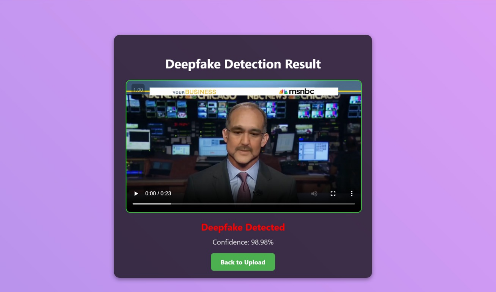

# 🧠 DeepFake Detection

A powerful and accurate deepfake detection system using **ResNet18-based CNN** architecture. This project combines video processing, face extraction, and image classification to distinguish between real and fake videos with high precision.

---

## 🌟 Features

- 🎥 Upload video via web interface (Flask-based)
- 🧑‍💻 Preprocessing pipeline: frame extraction → face detection → classification
- 🔍 Deep learning-based prediction using fine-tuned **ResNet18**
- 📊 Returns **verdict** (Real/Fake) along with **confidence percentage**
- 💻 Responsive UI with animated background, preview, and progress bar
- 🧠 Supports videos in `.mp4`, `.mov`, `.avi`, `.mkv`, `.webm` formats

---

## 🧾 Dataset Used

- **Dataset**: [FaceForensics++ (compressed version)](https://github.com/ondyari/FaceForensics)
- Real and fake videos were preprocessed into cropped face frames for training the model.

---

## 🚀 Demo Preview

 <!-- (Optional) Replace with actual screenshot if you want -->

---

## 📁 Project Structure

```bash
├── dataset/
│   ├── real/              # Real videos
│   └── fake/              # Deepfake videos
├── extracted_faces/
│   ├── real/
│   └── fake/
├── models/
│   └── resnet18_trained.pth
├── templates/
│   ├── index.html
│   └── result.html
├── 01_extract_frames.py
├── 02_preprocess_faces.py
├── 03_train_model.py
├── 04_predict_video.py
├── app.py                # Flask app
├── requirements.txt
└── README.md
```

## 🔓 Want Access to the Trained Model?
The trained model is too large for GitHub.
If you want access to the ResNet18 trained model (.pth file), fill out this short request form:

### 👉 Request Trained Model (Google Form)
After filling the form, the download link [(from Google Drive)](https://docs.google.com/forms/d/e/1FAIpQLSdj1ffzLdrTKga-41BciyToYhCLnjvNQ2VIlhAdrNdwbMPPyw/viewform?usp=header) will be shared with you via email.

## 🛠 Tech Stack
- Python 🐍
- PyTorch 🔥
- OpenCV 🎞️
- Flask 🌐
- ResNet18 (pretrained on ImageNet, fine-tuned for Deepfake binary classification)
